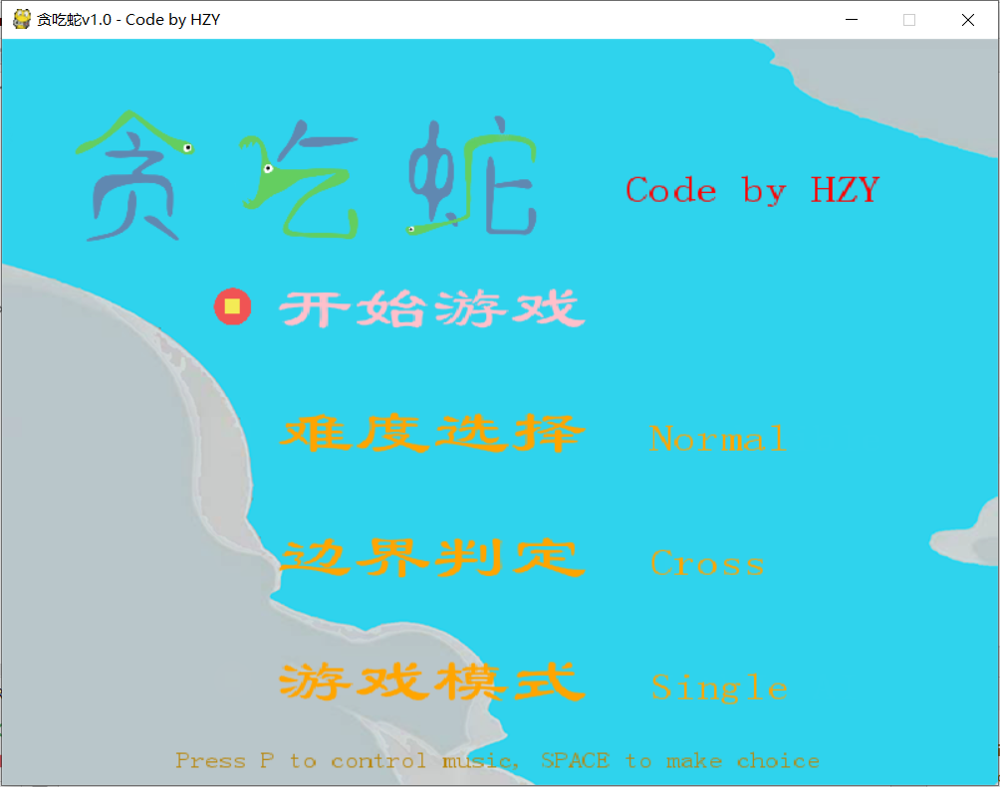
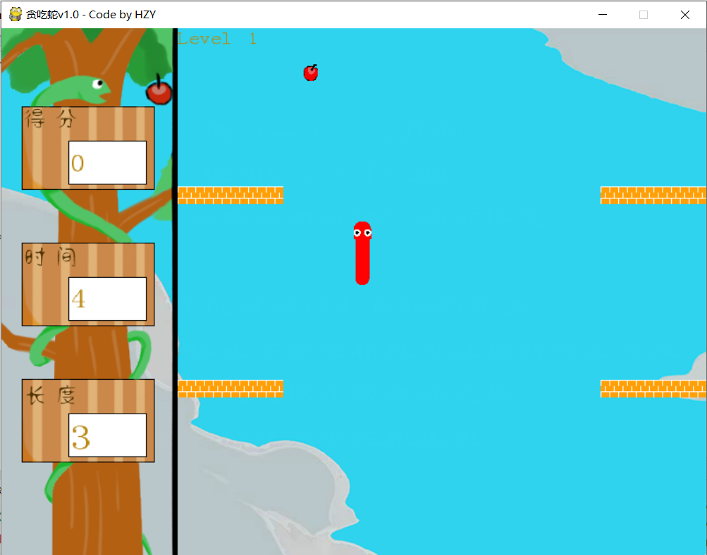

# Snaker via Pygame

大一暑假小学期的作品，一个贪吃蛇小游戏

- 支持单人闯关
- 支持双人对战
- 支持人机对战
- 同时，支持速度的调节

小学期一共也就十来天的时间，加上学习 python 语法和 pygame 这个库，整个项目只写了大约一个星期的时间（做工十分粗糙）

编辑器：Pycharm (python 3.8)

## 游戏操作

- 方向键 & WSAD 都可以控制蛇的移动方向
- 空格键为选择键，用于开始 / 结束游戏 / 修改游戏选项
- 按 P 键可以开关声音

## 启动方式

直接运行 main.py 就可以了

由于用到了系统字体，所以不同电脑的显示效果可能不同

## 运行截图

